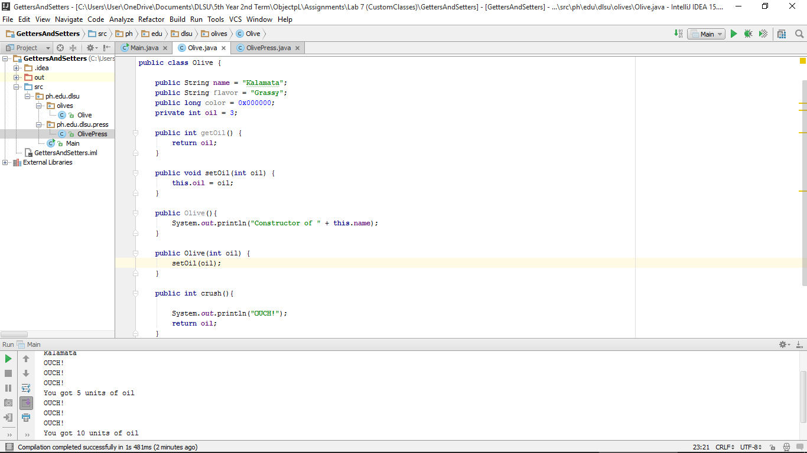

#GettersAndSetters

#ScreenShots

###Main

###Olive

###OlivePress

#Codes

###Main

~~~
package ph.edu.dlsu;

import ph.edu.dlsu.olives.Olive;
import ph.edu.dlsu.ph.edu.dlsu.press.OlivePress;

import java.util.ArrayList;

public class Main {

    public static void main(String[] args) {

        ArrayList<Olive> olives = new ArrayList<Olive>();

        Olive olive;

        olive = new Olive(2);
        System.out.println(olive.name);
        olives.add(olive);

        olive = new Olive(1);
        System.out.println(olive.name);
        olives.add(olive);

        olive = new Olive(2);
        System.out.println(olive.name);
        olives.add(olive);

        OlivePress press = new OlivePress();
        press.getOil(olives);

        System.out.println("You got " + press.getTotalOil() + " units of oil");

        press.getOil(olives);

        System.out.println("You got " + press.getTotalOil() + " units of oil");

    }
}
~~~

###Olive

~~~
package ph.edu.dlsu.olives;

public class Olive {

    public String name = "Kalamata";
    public String flavor = "Grassy";
    public long color = 0x000000;
    private int oil = 3;

    public int getOil() {
        return oil;
    }

    public void setOil(int oil) {
        this.oil = oil;
    }

    public Olive(){
        System.out.println("Constructor of " + this.name);
    }

    public Olive(int oil) {
        setOil(oil);
    }

    public int crush(){

        System.out.println("OUCH!");
        return oil;
    }

}
~~~

###OlivePress

~~~
package ph.edu.dlsu.ph.edu.dlsu.press;

import ph.edu.dlsu.olives.Olive;

import java.util.ArrayList;

public class OlivePress {

    private int totalOil = 0;

    public int getTotalOil() {
        return totalOil;
    }

    private void setTotalOil(int totalOil) {
        this.totalOil += totalOil;
    }

    public OlivePress(){
    }

    public void getOil(ArrayList<Olive> olives){

        int oil = 0;

        for (Olive olive: olives){

            oil += olive.crush();

        }

        setTotalOil(oil);

    }

}
~~~
